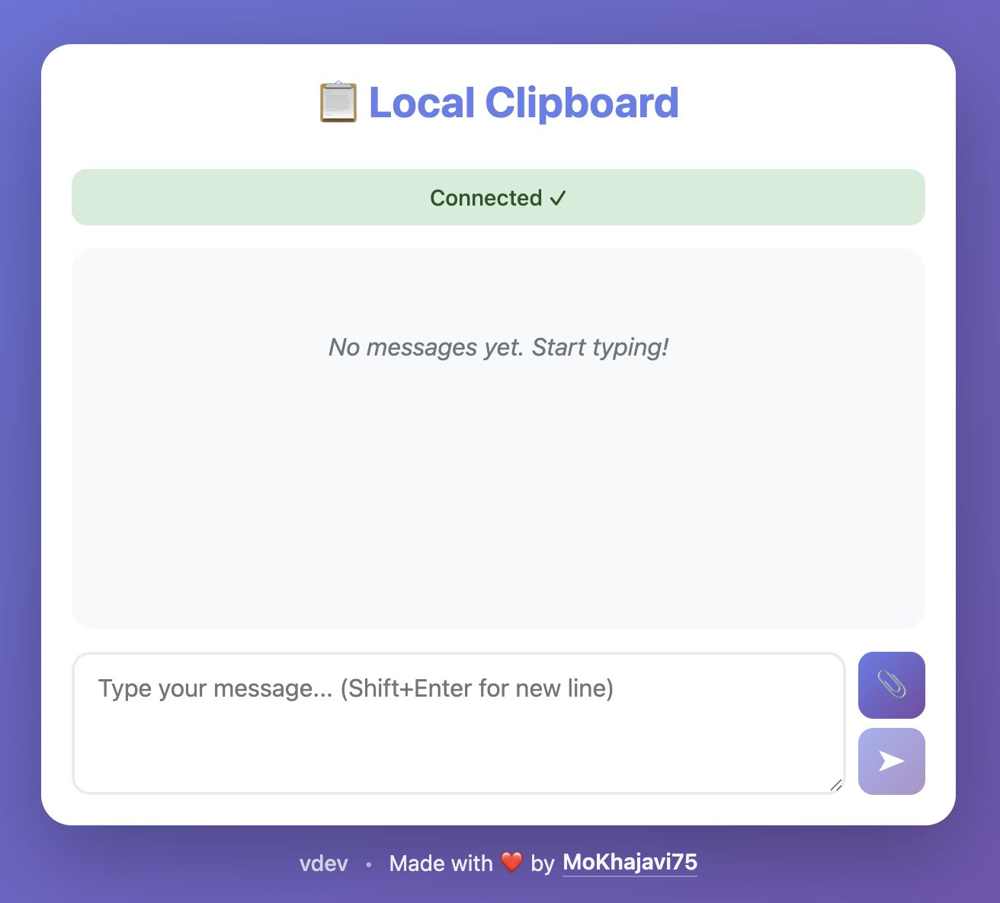

# Local Clipboard 📋

A simple, elegant local network clipboard/chat application. Share text and files between devices on your local network without internet.

<p align="center">
  
</p>

## Features

- ✨ Beautiful, modern UI with gradient design
- 🔄 Real-time text sharing via WebSocket
- 📎 File sharing and download support
- 📱 Works on any device with a browser (desktop, mobile, tablet)
- 🌐 No internet required - works on local network only
- 💾 In-memory storage (clears when server stops)
- 📋 One-click copy to clipboard
- 🎨 Responsive design for all screen sizes
- 🔒 Local network only - no data leaves your network

## Getting Started

### Download Latest Release

Download the latest prebuilt binary for your operating system from the [Releases](../../releases) page:

- **macOS**: Download `local-clipboard-vX.X.X-mac-silicon` (Apple Silicon) or `local-clipboard-vX.X.X-darwin-amd64` (Intel)
- **Linux**: Download `local-clipboard-vX.X.X-mac-intel`
- **Windows**: Download `local-clipboard-vX.X.X-windows-amd64.exe`

All binaries are self-contained with embedded web assets - no additional dependencies required.

### Run the Application

**macOS/Linux:**

```bash
# Make it executable
chmod +x ./local-clipboard-*

# Run the server (default port 8080)
./local-clipboard-*

# Or with custom port
./local-clipboard-* -port 3000
```

**Windows:**

```bash
# Run the server
local-clipboard-*.exe

# Or with custom port
local-clipboard-*.exe -port 3000
```

The terminal will display the server URLs for both localhost and your local network IP.

## Usage

1. **On your laptop/desktop:**
   - Open `http://localhost:8080`

2. **On your phone/tablet:**
   - Open `http://<your-ip>:8080` (e.g., `http://192.168.1.100:8080`)
   - The exact URL is shown in the terminal when you start the server

3. **Start sharing:**
   - Type a message and press Enter to send (Shift+Enter for new line)
   - Click the 📎 button to attach a file
   - Messages and files appear instantly on all connected devices
   - Click "Copy" to copy text to clipboard
   - Click "Download" to save files

## Building from Source

If you prefer to build from source:

### Prerequisites

- Go 1.16 or later installed
- Devices connected to the same local network

### Build and Run

```bash
# Show all available commands
make help

# Install dependencies
go mod download

# Run the server (default port 8080)
make run

# Run with custom port
make run PORT=3000

# Build for multiple platforms
make build
```

### Offline Development

If you need to work offline, you can vendor the dependencies:

```bash
go mod vendor
```

This will download all dependencies into a `vendor/` directory for offline use.

## Creating Releases

To create a new release, push a version tag:

```bash
git tag v1.0.0
git push origin v1.0.0
```

This will automatically:

- Build binaries for all platforms (macOS, Linux, Windows)
- Create a GitHub release with the version
- Upload self-contained binaries with embedded web assets
- Display the version in the web UI

## Notes

- All data is stored in memory and cleared when the server stops
- Works only on local network - no internet required
- Multiple devices can connect simultaneously
- Real-time synchronization across all connected devices
- Files are temporarily stored in memory (lost on server restart)
- No data leaves your local network

Enjoy your local clipboard! 🎉
